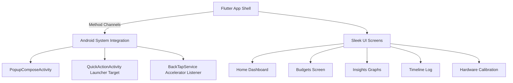

# 📱 TallyTap

TallyTap is an ultra-fast, privacy-first expense logging utility built with a hybrid Flutter and Kotlin architecture. The application is designed to validate a near-zero friction capture flow using launcher app shortcuts, native overlays, and sensor-based gesture detection, paired with a gorgeous, high-fidelity liquid-glass user interface.

---

## 🌟 Core Philosophy

- **Instantaneous Frictionless Capture**: Reduce expense logging down to under 2 seconds.
- **Local-First & Privacy-Focused**: No cloud sync, no tracker analytics, and no external data telemetry.
- **Premium Fluid Aesthetics**: Vibrant dark-themed HSL tailored accents, frosted glassmorphic layers, custom-drawn vector charts, and responsive micro-animations.
- **Lightweight Native Performance**: Zero-overhead boot, immediate focus, and responsive system service integration.

---

## 🎨 Premium Visual Features

TallyTap features a state-of-the-art custom design system:
- **Liquid Glass Bottom Navigation**: A floating glassmorphic nav bar suspended above the content fold using backdrop blur filters (`sigma: 14`) and a highly translucent Obsidian card mask (`opacity: 0.10`). It has an active indicator neon-mint pill that glides fluidly using spring curve micro-animations, while hiding label text on inactive items to minimize clutter.
- **Custom Vector Graphics**: 100% custom-painted Canvas widgets including:
  - `WeeklyTrendPainter`: Smooth bezier curves and gradients showing daily spend momentum.
  - `DonutChartPainter`: Dynamic radial distribution breakdown for categories.
  - `BudgetRingPainter` & `IntentRingPainter`: Clean circular progress trackers for budget margins.
- **Unified Style Tokens**: Harmonized neon mints, warm ambers, obsidian fields, and premium gradients defined under `TallyTapTheme`.

---

## 🛠️ Hybrid Architecture

TallyTap utilizes a dual-engine architecture to blend the flexibility of cross-platform components with deep system hooks:



### 1. Frontend Shell (Flutter + Riverpod State Management)
- **`lib/screens/home_screen.dart`**: Dashboard showing total cash flow balance, category breakdowns, budget alerts, and recent items.
- **`lib/screens/budgets_screen.dart`**: Complete budget dashboard supporting category limits, custom recurring structures, and intent tracking.
- **`lib/screens/insights_screen.dart`**: Full analytics suite showcasing weekly spending trendlines, categories, and payment channels.
- **`lib/screens/timeline_screen.dart`**: chronological historical transaction register.
- **`lib/screens/calibration_screen.dart`**: Hardware accelerometer calibration UI to customize threshold impulses.

### 2. Native System Integration (Kotlin + Jetpack Compose)
- **`PopupActivity`**: An instantly loaded, dialog-themed translucent Compose card that launches directly over any app overlay to capture amount inputs with immediate virtual keyboard focus.
- **`QuickActionActivity`**: An invisible, fast-redirect launcher utility mapping static app shortcuts directly to logging services.
- **`BackTapService`**: A foreground service listening to high-frequency raw `Sensor.TYPE_ACCELEROMETER` data.
- **`BackTapDetector`**: Processes Z-axis delta spikes through a high-frequency filter to recognize when a user physical taps the back case of their phone.

---

## 🚀 How to Run the Project

### Prerequisites
- **Flutter SDK**: Active environment path (`flutter --version`).
- **Android SDK (API 29+) & Emulator / Physical Device**: Connected over developer bridge (`adb`).
- **Java JDK (17+)**: Configured on terminal paths (`JAVA_HOME`).

### Build & Deploy
1. Connect your Android device or spin up an emulator.
2. Resolve dependencies:
   ```bash
   flutter pub get
   ```
3. Run the development build:
   ```bash
   flutter run
   ```

---

## 🧪 How to Test Capture Triggers

### Trigger Method 1: Interactive App Flow
- Open the TallyTap dashboard from your launcher.
- Press the floating Neon Mint `+` button in the Bottom Navigation Bar.
- The screen will transition seamlessly to the Create Transaction view. Fill out the details and click **"Add Transaction"**.

### Trigger Method 2: Launcher App Shortcut
- Long-press the **TallyTap** app icon on your home screen drawer.
- Select the **"Quick Add"** static shortcut.
- The translucent Compose logging overlay card will popup instantly on top of your home screen.

### Trigger Method 3: Built-in Double Back Tap (Hardware Gesture)
- Launch the TallyTap application.
- Navigate to **Settings** -> select **"Double Back Tap"** to enable the foreground background service.
- Firmly double-tap the back casing of your phone.
- The accelerometer recognizes the impulse signature and displays the translucent compose overlay instantly.

---

## ⚠️ System & Sensitivity Notes

- **Background Execution**: Custom Android systems frequently terminate background sensor listeners to preserve battery. To guarantee robust physical tap recognition in the background, navigate to **App Info** -> **Battery** -> select **"Unrestricted"** for TallyTap.
- **Sensor Calibration**: Accelerometer sensitivities fluctuate across different device builds and physical casings (metal, plastic, carbon fiber, or glass). Go to **Settings** -> **Double Back Tap Calibration** inside the app to dial in your device's physical casing impulse threshold.

